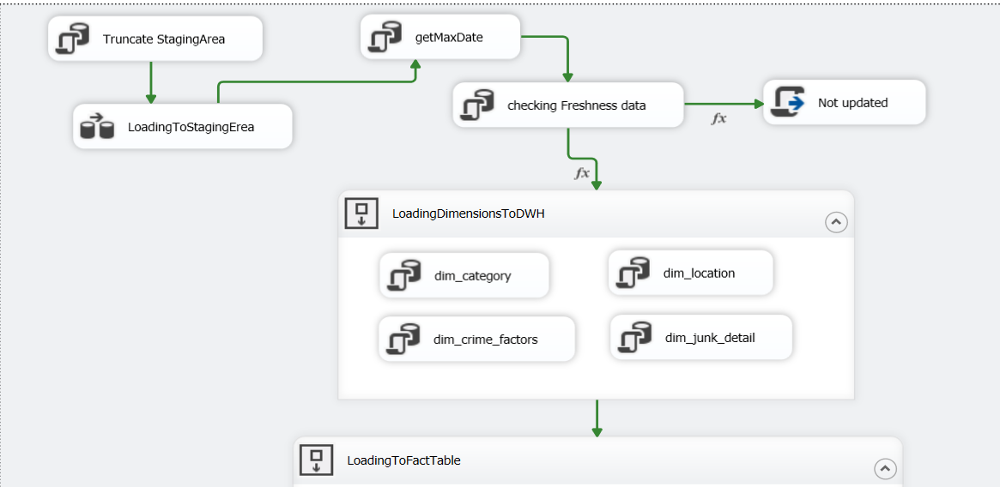
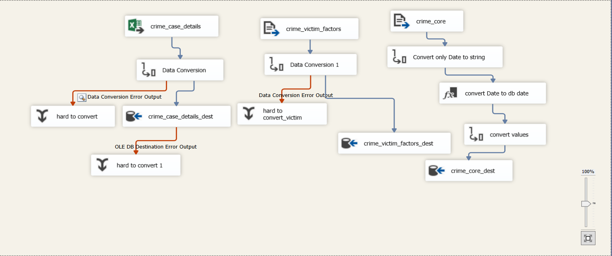
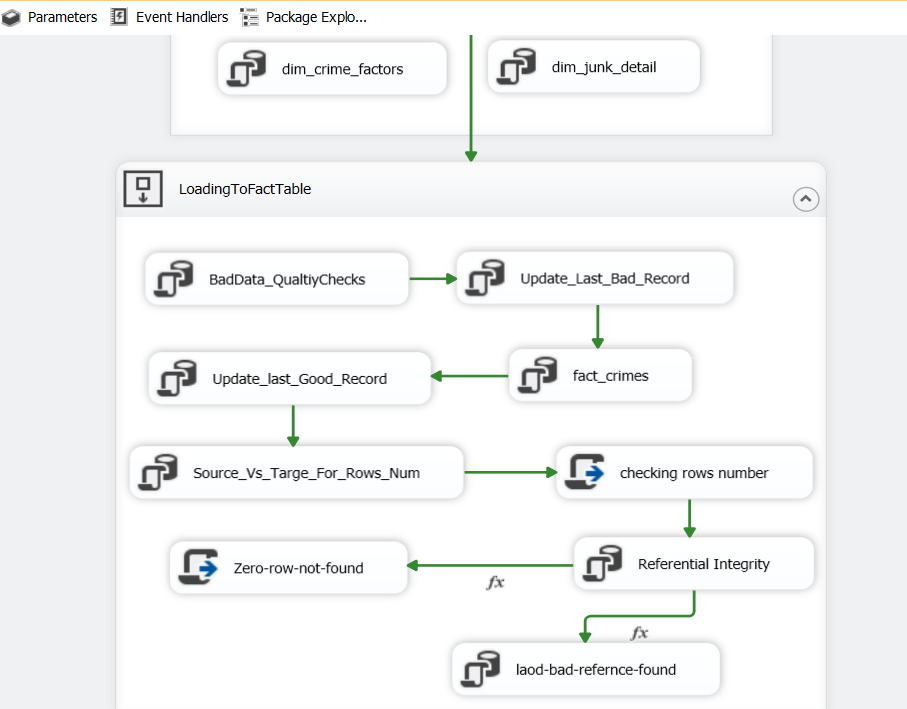

# **Project Overview**
**This project transforms crime data from multiple operational sources into a unified analytical model for reporting and analysis. By combining crime incident records, case details, and victim/suspect information, it creates a complete view of each crime event, including where and when it happened, how it was handled, and who was involved.**

**The integrated dataset supports crime trend analysis, hotspot detection, response performance monitoring, case outcome tracking, and demographic analysis. It provides a reliable foundation for dashboards, reporting, and data-driven decision-making in public safety and law enforcement.**

----
## **Objectives**
-  **Integrate crime incident, case details, and victim/suspect data into a single unified dataset using Crime_ID.**
-  **Provide a complete, consistent view of each crime event covering location, time, case handling, and involved individuals.**
-  **Enable analysis of crime patterns, hotspots, and operational performance metrics such as response time and arrest rates.**
-  **Support data-driven decision-making for public safety through reporting, dashboards, and behavioral analysis.**

-----
## Data dictionary about source
### 1. Crime Core
| **Column Name**       | **Description**                                 |
| --------------------- | ----------------------------------------------- |
| **Crime_ID**          | Unique identifier for each crime incident       |
| **Crime_Date**        | Date when the crime occurred                    |
| **Crime_Time**        | Time when the crime occurred                    |
| **Time_Block**        | Time-of-day category of the incident            |
| **Area**              | Main geographical area where the crime occurred |
| **District**          | Administrative district of the incident         |
| **Neighborhood**      | Neighborhood where the crime took place         |
| **Crime_Category**    | High-level classification of the crime          |
| **Crime_Type**        | Specific type of crime committed                |
| **Location_Type**     | Type of location where the incident occurred    |
| **Reporting_Channel** | Channel through which the crime was reported    |
| **Latitude**          | Latitude coordinate of the crime location       |
| **Longitude**         | Longitude coordinate of the crime location      |

----

### 2. Crime Case Details

| **Column Name**       | **Description**                                |
| --------------------- | ---------------------------------------------- |
| **Crime_ID**          | Unique identifier for each crime incident      |
| **Weapon_Used**       | Weapon involved in the incident, if applicable |
| **Arrest_Made**       | Indicates whether an arrest was made           |
| **Case_Status**       | Current status of the case                     |
| **Property_Loss_EGP** | Estimated property loss in Egyptian Pounds     |
| **Injury_Level**      | Severity of injury caused by the incident      |
| **Response_Time_Min** | Officer response time in minutes               |
| **Officer_Count**     | Number of officers assigned to the case        |
| **Priority_Level**    | Priority level assigned to the incident        |

-------
### 3. Crime Victim Factors

| **Column Name**      | **Description**                                    |
| -------------------- | -------------------------------------------------- |
| **Crime_ID**         | Unique identifier for each crime incident          |
| **Victim_Age**       | Age of the victim                                  |
| **Victim_Gender**    | Gender of the victim                               |
| **Suspect_Age**      | Age of the suspect                                 |
| **Suspect_Gender**   | Gender of the suspect                              |
| **Repeat_Offender**  | Indicates whether the suspect has prior offenses   |
| **Domestic_Related** | Indicates whether the incident is domestic-related |

-------

## Project Workflow
-  **Extract crime data from multiple sources (Crime Core, Case Details, Victim Factors).**
-  **Load raw data into a staging area after truncating previous data.**
-  **Apply transformations and load data into dimension tables (location, category, crime factors, etc.).**
-  **Apply pre-load data validation rules on the cleaned dataset to ensure data quality before loading into the fact table.**
-  **Load validated data into the fact table (fact_crimes).**
-  **Enforce post-load referential integrity checks to ensure all foreign keys correctly map to the related dimension tables.**
-  **Perform final data quality checks, including bad records detection and row count reconciliation.**
-  **Track successful and failed loads using control variables (last good / bad records).**
-  **Use max date logic to support incremental data loading.**

## 
**Data Pipeline**

### **Extraction → Staging Area Processing → Dimensional Data Loading**

### **Staging Area Processing**

-  **Applied Simple Transformation**
- **Performed data type conversion to ensure consistency and proper formatting.**
- **Created derived columns for date handling and temporal analysis.**

## 
**Fact Table Loading & Data Quality Checks**

-   **Perform incremental extraction to retrieve only new records.**
-   **Apply data validation rules to ensure values meet defined constraints.**
-   **Load only validated and cleansed data into the fact table.**
-   **Reject and isolate invalid records for further inspection or correction.**
-   **Conduct post-load referential integrity checks to ensure all foreign keys correctly reference dimension tables.**

